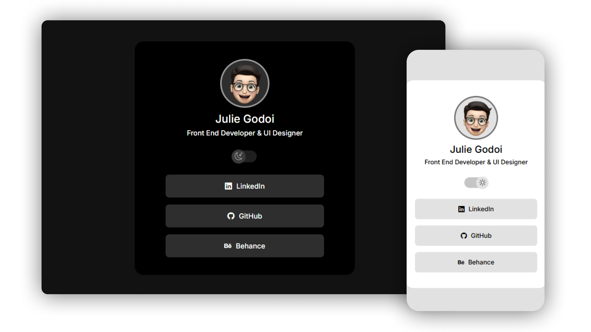

<h1 align="center"> meus-links </h1>

 

  

## 💻 Projeto

Este é um agregador de links para usar como cartão de visitas online.

Esse projeto foi desenvolvido junto ao <strong>Discover</strong> da <strong>Rocketseat</strong> com as seguintes tecnologias:

- HTML e CSS
- JavaScript
- Git e Github

##
[Acesse o projeto finalizado aqui](https://julie-godoi.vercel.app/)
