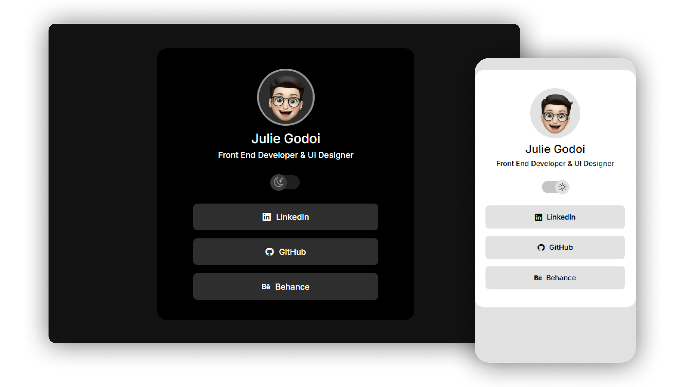

<h1 align="center"> devLinks </h1>

 

  

## 💻 Projeto

O devLinks é um agregador de links para usar como cartão de visitas online.

Esse projeto foi desenvolvido junto ao <strong>Discover</strong> da <strong>Rocketseat</strong> com as seguintes tecnologias:

- HTML e CSS
- JavaScript
- Git e Github

- [Acesse o projeto finalizado aqui](https://juliegodoi.github.io/devLinks/)
